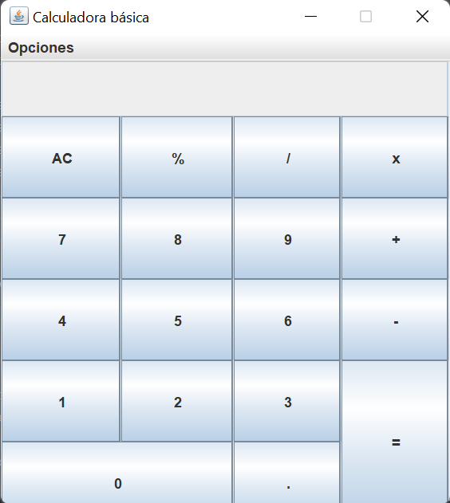
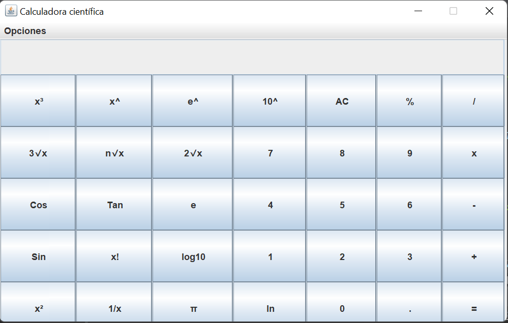

<h1 align="center"> Calculadora 🖩 </h1>

## Descripción del proyecto 📝 
Calculadora con interfaz gráfica con 2 funciones(Basica y Científica).

## Tecnologías empleadas
* Java 11.0.8
* Eclipse
* Swing
* Maven

### ***Capturas del proyecto***
###### Básica 

###### Científica 

